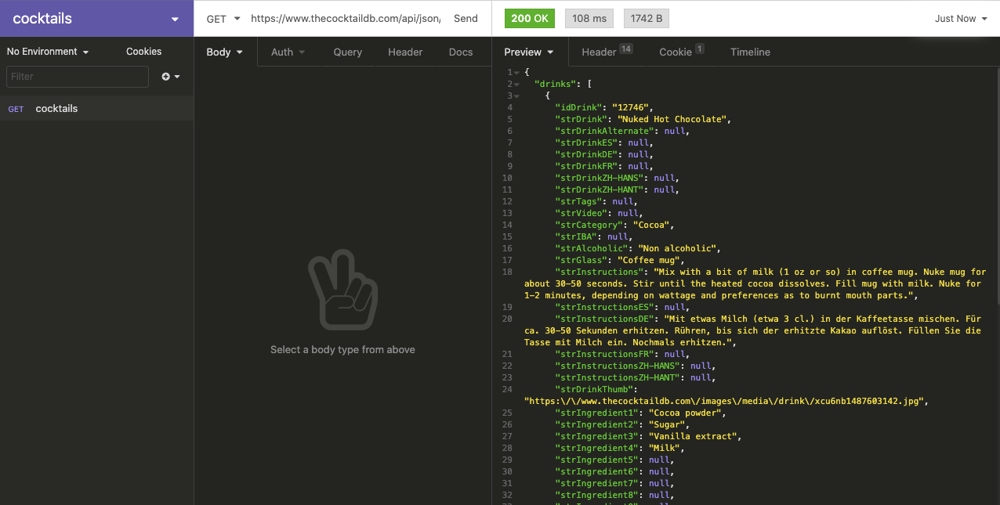
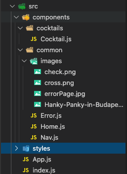

# General Assembly | SEI-49 -project-two

  

  

## :star2: Overview

  

Working in a team of 2, Aishath and I created an app for the user to choose a cocktail they would like to make themselves. By clicking on the tick you will see the instructions and ingredients. The aim was to:
-   **Consume a public API**
-   **Have several components**  
-   **The app would have a router** 
-   **Be deployed online**  
  

## :hourglass_flowing_sand: Timeframe

  

48 Hours

## :computer: Technologies Used

  

* HTML5

* CSS3, SCSS, SASS

* HTML5 AUDIO

* JavaScript (ES6)

* GitHub and Git

* Google Fonts

* REACT, react-Router-Dom

* Axios

* Development server: Yarn

  

## The API

We used TheCocktailDB API to generate a wide range of cocktails. This API allowed us to access the cocktails from multiple ways which was how we could display the ingredients separately.

  ## The Process
  
 We struggled to begin with to find the right API for our ideas. When we decided on the CocktailDB we planned out what the main features of our app should be:
 - Display the name and image of the drink.
 - If the user likes the drink, by clicking 'yes' the recipe appears.
 - If the user clicks 'no', it moves on to the next drink.
 
From there we used Insomnia to test out how were were to retrieve the data according to what we wanted to display on the application.

##
Using React for our application, we made different components for different sections of the page. This is to keep the code cleaner and also help to identify while files belong to which part of the application.
 

 
All the component files in our application.

## :confounded: Challenges

We had trouble figuring out how to link the measurements of the the liquor to the ingredient as they were listed separately. Needed to implement the `startsWith()` method in order to select the correct key value.

  

 

Example of how the data in the JSON file is displayed.

  

 

The logic to combine the ingredients to the measurements.

  
  

## :trophy: Wins

Had a great time working with Aishath. Felt like a great achievement to finish an app in a hackathon style of 48hours and also incorporating an API to the application.

## :bulb: Key Learning

Understanding how to use components to split the application up into smaller files. Making sure to plan out what the objectives are for an application which will make the steps clearer to reach the end goal.

https://a-drink-to-suit-your-mood.netlify.app/