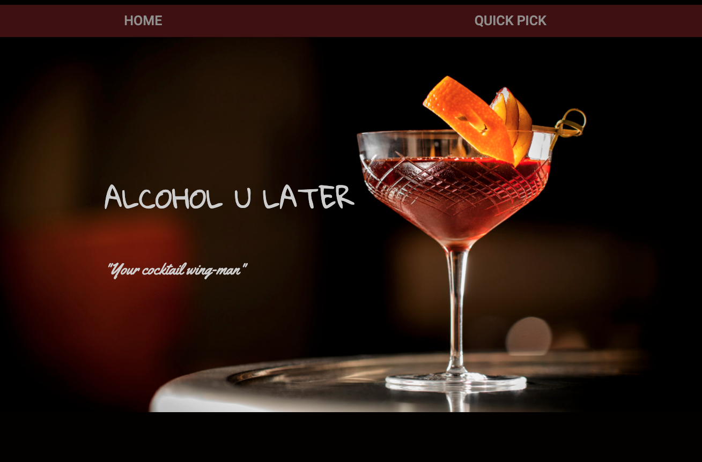
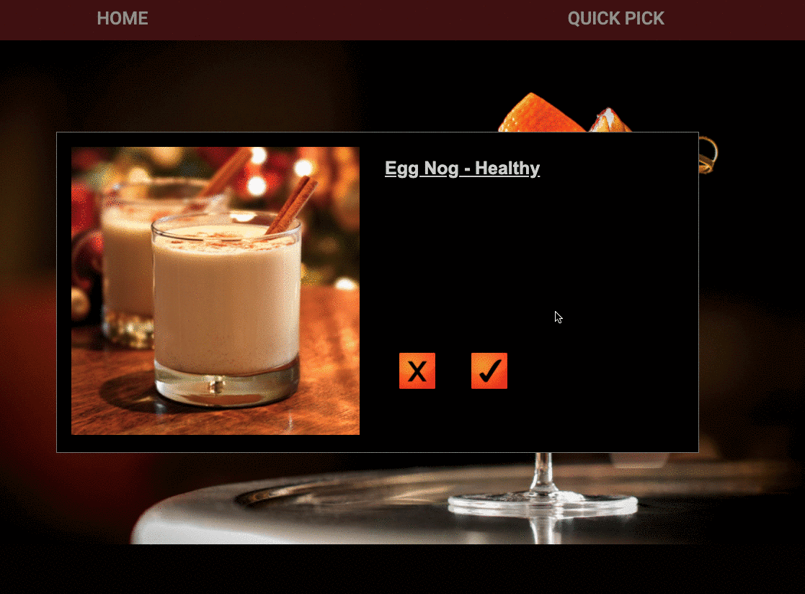
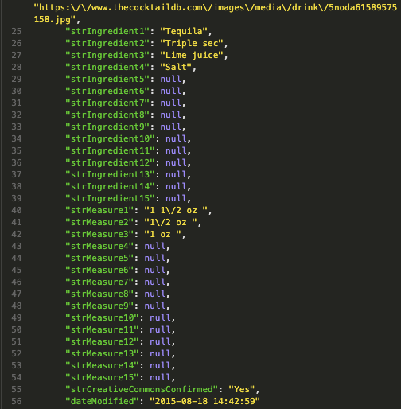
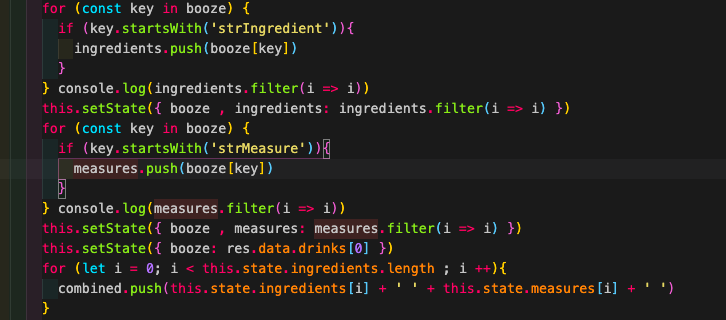

 # General Assembly | SEI-49 -project-two

## :star2: Overview

Working in a team of 2, Aishath and i created an app for the user to choose a cocktail they would like to make themselves. By clicking on the tick you will see the instructions and ingredients.

## :hourglass_flowing_sand: Timeframe

48 Hours
## :computer: Technologies Used

* HTML5
* CSS3, SCSS, SASS
* HTML5 AUDIO
* JavaScript (ES6)
* GitHub and Git
* Google Fonts
* REACT, react-Router-Dom
* Axios
* Bulma
* Development server: Yarn

##  The API
We used TheCocktailDB API to generate a wide range of cocktails. This API allowed us to access the cocktails from multiple ways which was how we could display the ingredients separately.

## :confounded: Challenges
We had trouble figuring out how to link the measurements of the the liquor to the ingredient as they were listed separately. Needed to implement the `startsWith()` method in order to select the correct key value.

 
Example of how the data in the JSON file is displayed.

 
The logic to combine the ingredients to the measurements.

## :trophy: Wins
Had a great time working with Aishath. Felt like a great achievement to finish an app in a hackathon style of 48hours and also incorporating an API.
